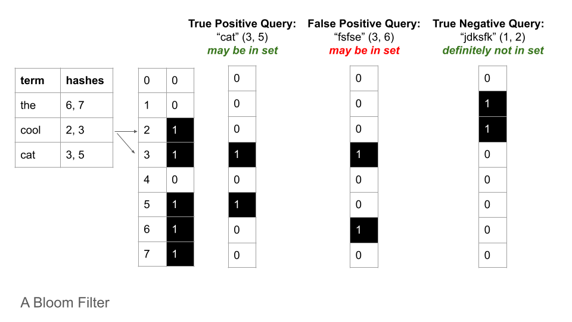
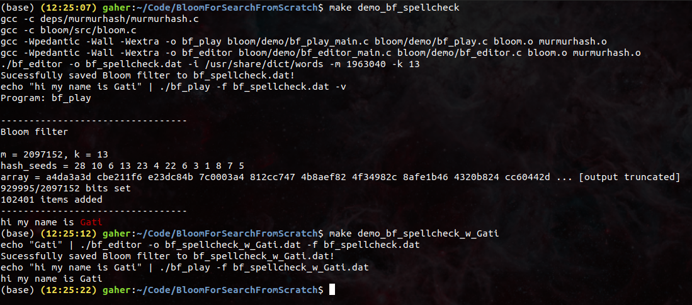
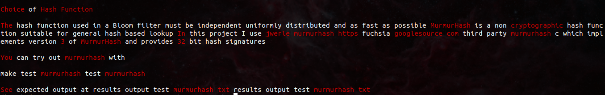
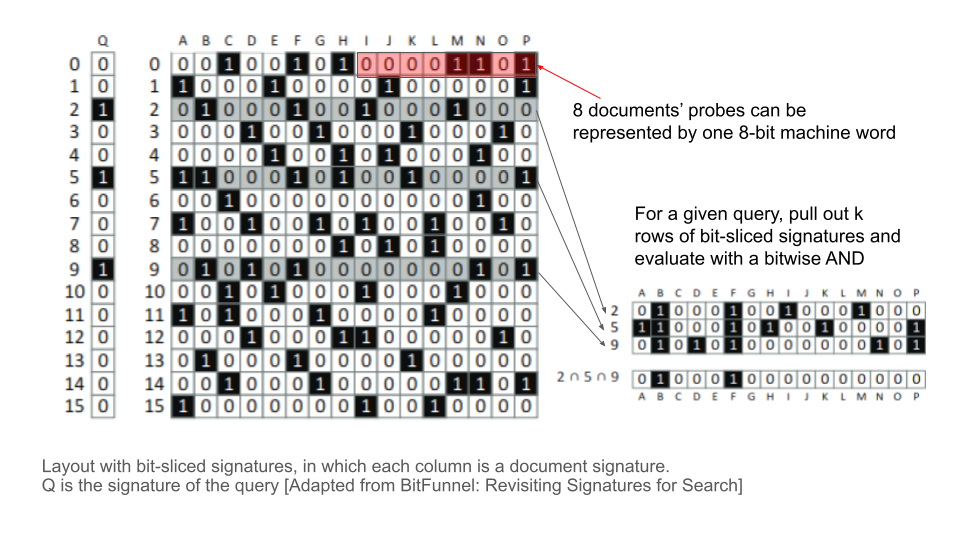

# Bloom For Search From Scratch

> Gati Aher  
> SP2021: Software Systems  
> Olin College of Engineering  

In this project I implement a Bloom filter and a bit-sliced document signature in C. I also implement tests to make sure my implementations works as expected, and fun demos to show how these data structures can be used.

How to run the demos:
```bash
# demo 1: 
make demo_bf_spellcheck

# demo 2:
make demo_bf_spellcheck_readme

# demo 3:
make demo_bss_xkcd_query
```

See the `MakeFile` for examples of how to run the programs. Also, all programs are properly documented in the header files, and running the `<program_name> -h` will reveal argument details for running the program.

See test and demo output results in the [results folder](results).

## Bloom Filter

The Bloom filter is a probabilistic, space-efficient data structure that can tell you whether an object is in a collection with the possiblity of a false positive. It does not store the terms directly, it just stores indicators (a.k.a. hashes, probes) of each term’s presence. 



False positive matches are possible, but false negatives are not: so given a query it can either return "possibly in set" or "definitely not in set". This false positive rate can be controlled by increasing number of bits and increasing number of hash functions (See section: [Note On Controlling False Positives](##note-on-controlling-false-positives)).

The probabilistic feature allows Bloom filters to do membership validation in very little time and very little space. So these Bloom filter lookup tables can even be stored in a browser cache without taking up a significant amount of space. In the real world, Bloom filters are used to quickly tell you if a username is taken, or to quickly check if a website is known to be malicious. They have also been used as spell-checkers and filters for censoring words. The start-up I was interning for last summer implemented a Bloom filter to speed up their database querying times by avoiding checking the database for almost all items which won't be found in it anyway, thus saving a lot of time and effort.

I implement two demos to show the functionality of Bloom filters.

### Demo 1: Bloom filter to spellcheck a query.

My first demo creates a Bloom filter to check for properly spelled words. It uses a list of words from `/usr/share/dict/words`. For preprocessing, it splits terms by ` !\"#$%%&()*+,-./:;<=>?@[\\]^_`{|}~`

First it creates and saves the Bloom filter, and then loads and uses that Bloom filter to evaluate a query from `stdin`. In the first query it highlights my name (Gati) as spelled wrong, as it was not included in the original list.

Since I want my spellchecker to recognize my name, I use my Bloom filter editor program to load, edit and save the Bloom filter so that it recognize my name (Gati) as a properly spelled word. Then I load and use the new Bloom filter to evaluate the query again. This time, it recognizes my name as a correctly spelled word.



An important property of Bloom filters is that items can be added to it, but items cannot be removed, as deleting the set bits of a query may impact the set bits of other items.

The spellchecker demo adds 102401 terms, hashes each term with 13 hash functions, and stores everything in a bit signature of 2097152 bits (262KB). Using standard probability functions (explained on [GeeksForGeeks](https://www.geeksforgeeks.org/bloom-filters-introduction-and-python-implementation/), also this [calculator](https://hur.st/bloomfilter/?n=102401&p=&m=2097152&k=13)), the saved Bloom filter I use for spellchecking has a 0.000054525 probability (1 in 18340 chance) of a false positive.

Furthermore, the resulting Bloom filter is ~262KB, which is 1/4th of the size of the original `/usr/share/dict/words` word list (972.4KB).

### Demo 2:

My Bloom filter spellchecker can also be used to spellcheck files. I have a demo that uses my Bloom filter to spellcheck my README:



In the screenshot you can see words flagged as incorrect highlighted in red. You can see that, in addition to flagging non-English words like "https" and "murmurhash", it also flags words with atypical casing. For example, it believes that "It" is incorrect, as only "it" exists in its vocabulary.

This actually a super helpful tool for spellchecking my README and `.txt` files that do not have a built-in spellchecker! I can quickly read through it on my terminal and change words that are obviously spelled wrong. In this case, using a Bloom filter as the first pass spellchecker limits the words I have to check manually, which allows me to utilize my brain power more effectively. :)

### Interesting Further Reading / Use-Cases for Bloom Filters

Bloom filters are simple in theory, and easily adaptable for other use-cases.

For example:

Bitly uses Bloom filters to keep track of an everchanging list of malicious website that they should not create links for.

* [bitly/dablooms: scaling, counting, bloom filter library](https://github.com/bitly/dablooms)

Bloom filters have also been used for tracing networks:

* [URL History Bloom Filters](https://commerce.net/url-history-bloom-filters/)
* [When Bloom filters don't bloom](https://blog.cloudflare.com/when-bloom-filters-dont-bloom/)

Other interesting use-cases to check out:

* [Some Motley Bloom Tricks](http://www.cap-lore.com/code/BloomTheory.html)
* [Look, Ma, No Passwords: How & Why Blackfish uses Bloom Filters](https://blog.shapesecurity.com/2018/09/26/look-ma-no-passwords-how-why-blackfish-uses-bloom-filters/)
* [Fast candidate generation for real-time tweet search with bloom filter chains](https://users.umiacs.umd.edu/~jimmylin/publications/Asadi_Lin_TOIS2013.pdf)

## Bit-Sliced Document Signatures

In addition to the Bloom filter, I also implement a Bloom filter-based data structure called bit-sliced signatures, that can be used to retrieve documents that contain all the words.

A document can be represented by its document signatures, which is just a Bloom filter containing all the terms in a document.

If all the signatures have the same length and share a common hashing scheme, each document can be represented by a bit-sliced signature. In this approach, document signatures are stored in a big table, like a nested array of machine words (32-bit integers). Each row corresponds to one hash value. In the row, each of the 32 bits in an element correspond to 32 documents, and the bit is on or off depending on whether the document has the hash value.



Given a query, the program builds a query signature by hashing each term in the query with the same bag of hash functions, and then checks if any of the document signatures have all of the query hashes. If all of the query hashes are not present in the document signature, there is no possibility of the document containing all of the terms in the query. However, since sets of terms can have the same hashes, there is a possibility of falsely saying all the query terms are in the document.

### Demo 3: keyword search on xkcd comics transcripts

So as a fun information retrieval demo, I decided to see if my bitsliced document signature could retrieve documents that have all the words in the query.

In this demo, I add 40 documents (allocating two blocks of 64 bits), use signatures of length 512, and 3 hashes on each term. Each document comprises of the title, alt-text, and transcript of a given xkcd comic. This information is scraped from [https://www.explainxkcd.com/](https://www.explainxkcd.com) using a Python script with beautifulsoup.

In the demo I query the word "outside". This word actually appears in two documents: 30 and 14.
Here is an excerpt of the final results:

```
---------------------------------
Bit-Sliced Block Signature

m = 512, k = 3, num_blocks = 2
39/64 docs added
hash_seeds = 28 10 6 
array = 
197188	0	
16908928	8	
1694507008	0	
17306112	0	
17104896	0	
-946130846	49	
1092625410	0	
1611989056	0	
-105968822	187	
165224480	8	
... [output truncated]
colsums = 0 103 69 23 69 162 175 82 83 160 95 68 116 206 85 89 324 167 155 219 263 122 88 212 428 56 92 98 88 207 159 97 220 71 65 114 80 122 97 89 0 0 0 0 0 0 0 0 0 0 0 0 0 0 0 0 0 0 0 0 0 0 0 0 

percent filled = 0=0.00% 1=0.20% 2=0.13% 3=0.04% 4=0.13% 5=0.32% 6=0.34% 7=0.16% 8=0.16% 9=0.31% 10=0.19% 11=0.13% 12=0.23% 13=0.40% 14=0.17% 15=0.17% 16=0.63% 17=0.33% 18=0.30% 19=0.43% 20=0.51% 21=0.24% 22=0.17% 23=0.41% 24=0.84% 25=0.11% 26=0.18% 27=0.19% 28=0.17% 29=0.40% 30=0.31% 31=0.19% 32=0.43% 33=0.14% 34=0.13% 35=0.22% 36=0.16% 37=0.24% 38=0.19% 39=0.17% 40=0.00% 41=0.00% 42=0.00% 43=0.00% 44=0.00% 45=0.00% 46=0.00% 47=0.00% 48=0.00% 49=0.00% 50=0.00% 51=0.00% 52=0.00% 53=0.00% 54=0.00% 55=0.00% 56=0.00% 57=0.00% 58=0.00% 59=0.00% 60=0.00% 61=0.00% 62=0.00% 63=0.00% 
---------------------------------
Sucessfully saved bit-sliced signature to bss_xkcd.dat!
echo "outside" | ./bss_play -f bss_xkcd.dat -s "https://xkcd.com/%d"

4 Documents matching query: 
https://xkcd.com/30
https://xkcd.com/24
https://xkcd.com/16
https://xkcd.com/14
```

My probabilistic data structure returns 4 matches: 30, 24, 16, 14. As expected there are the two true positives and no false negatives. However, documents 16 and 24 are false positives. Upon taking a closer look, the document signatures for documents 16 and 24 are 63% and 84% full respectively. That means, each bit has a higher than random chance possibility of being flipped, so the probability of the query hash being falsely present in the signature is pretty high.

To reduce the rate of false positives, I can increase the length of the bit signature so that it is less full. If I was using bit-sliced signatures in a production system, there are some interesting optimizations that reduce query speed, memory usage, and false positive rate (e.g. intelligent corpus sharding, weighted Bloom filters).

### Interesting Further Reading / Use-Cases for Bit-Sliced Signatures

All large-scale information retrieval systems use inverted indexes for efficiently performing data retrieval based on keyword search. However, adding a new document to an inverted index requires a costly global operation to update the posting list for each term in the document. To save time on this operation, invented indexes generally use batch updates. In order to support user queries on documents that are waiting on the batch update, e.g. people searching for real-time news, Bing uses a bit-sliced signature-based data structure called BitFunnel that can ingest new documents with a quick local update while also supporting rapid keyword search.

* [Goodwin, Bob, et al. “BitFunnel.” Proceedings of the 40th International ACM SIGIR Conference on Research and Development in Information Retrieval, 2017, doi:10.1145/3077136.3080789.](https://danluu.com/bitfunnel-sigir.pdf)

Bit-sliced signatures also frequently come up in the microbiology space, in particular when performing search on bacterial or viral data sets WGS data sets.:
* [BItsliced Genomic Signature Index [BIGSI] Docs](https://bigsi.readme.io/)

## Note On Controlling False Positives

You can control the number of false positives (reduce collision) by increasing number of signature bits (m) and increasing number of hash functions (k).

The value of m configures how many bits will be allocated for the bit array. Ideally, when all the items are added, the bit array should be approximately half full. Worst case is if the bit array is completely full (all 1s), as it will say that every query may be in the filter (false positives). For performance reasons, the bit array rounds m to the nearest largest power of 2.

The value of k configures how many hash functions will be used in the Bloom filter hashing scheme. A higher number of hash functions means that there is a higher signal to noise ratio, where signal is the probability that if the term is a member of set given that all the term's probes are present in the Bloom filter, and noise is the probability of a false positive. Rarer terms have a higher likelihood of being a false positive, so increasing k improves the signal to noise ratio and allows for better retrieval of rate terms. However, a larger k leads more hash operations, and therefore slower insertion and lookup time. The seeds of the hash function are generated with a random number generator in order to be independent, uniformly distributed.

## Choice of Hash Function:

The hash function used in a Bloom filter must be independent, uniformly distributed, and as fast as possible. MurmurHash is a non-cryptographic hash function suitable for general hash-based lookup. In this project, I use [jwerle/murmurhash](https://fuchsia.googlesource.com/third_party/murmurhash.c/) which implements version 3 of MurmurHash and provides 32-bit hash signatures.

You can try out murmurhash with
```
make test_murmurhash && ./test_murmurhash
```
See expected output at [results/output_test_murmurhash.txt](results/output_test_murmurhash.txt).
